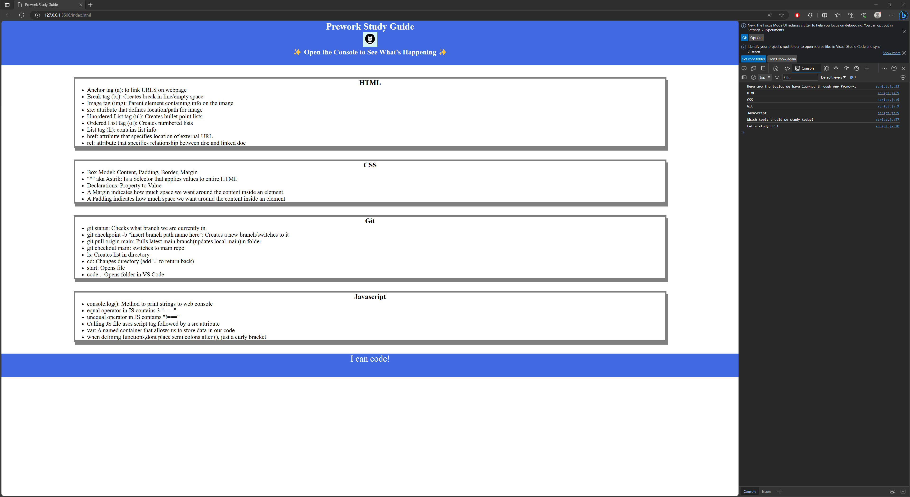

# UC Berkeley Boot Camp Prework Study Guide

## Description

This is a prework study guide created for other students starting their fall semester in a coding boot camp or working towards a CS Degree. It contains notes on topics suchs as HTML, CSS, Git, and JavaScript.

## Installation

N/A

## Usage

To use this study guide, you can review the notes in each section. For a random suggestion open Chrome Dev Tools, press Control+Shift+I (Windows) Command+Option+I (Mac) and choose console to see prompts.

## Credits

N/A

## License

Please refer to the LICENSE in the repo.